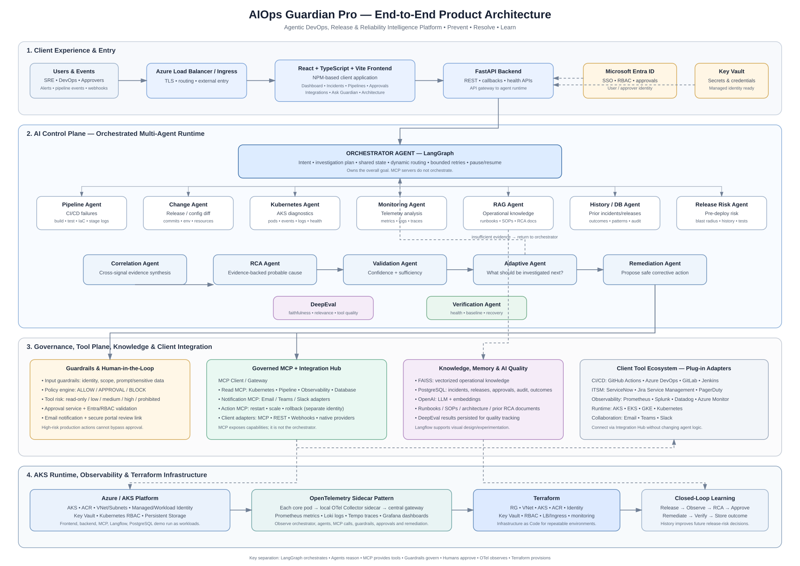

# Architecture

## End-to-end product architecture

The primary presentation-ready architecture is embedded below. It intentionally separates the responsibilities of the Orchestrator Agent, specialized agents, MCP tool plane, guardrails, client integrations, knowledge/memory, observability, and Azure/AKS infrastructure.



### Diagram assets

- `diagrams/end-to-end-product-architecture.svg` — presentation-ready scalable diagram
- `diagrams/end-to-end-product-architecture.png` — high-resolution PNG
- `diagrams/end-to-end-enterprise-architecture.svg` — detailed engineering connection view
- `diagrams/end-to-end-enterprise-architecture.png` — high-resolution detailed PNG
- `diagrams/end-to-end-enterprise-architecture.dot` — editable Graphviz source


## Design principles

1. One **Orchestrator Agent** owns the overall goal.
2. Specialized agents own domain reasoning.
3. MCP is the controlled tool and integration plane.
4. LangGraph owns runtime state, routing, bounded loops, and pause/resume.
5. Guardrails are deterministic policy outside the LLM's discretion.
6. Production/high-risk actions require human approval.
7. Every agent/tool/policy/action is observable and auditable.
8. Client integrations are provider adapters rather than hardcoded agent logic.

## Logical architecture

```text
                               USERS / EVENTS
                                    |
                           Azure LB / Ingress
                                    |
                       React UI + FastAPI API
                                    |
                  +-----------------+-----------------+
                  |     ORCHESTRATOR AGENT            |
                  |         LangGraph                 |
                  | intent / plan / state / routing   |
                  | retry / pause / resume / complete |
                  +-----------------+-----------------+
                                    |
       +----------------------------+--------------------------+
       |                |               |           |           |
   Pipeline         Kubernetes       Monitoring    Change      RAG
    Agent              Agent           Agent       Agent      Agent
       |                |               |           |           |
       +----------------+---------------+-----------+-----------+
                                    |
                              History Agent
                                    |
                          Correlation / RCA Agent
                                    |
                           Validation Agent
                                    |
                            Adaptive Agent
                                    |
                          Release Risk / Policy
                                    |
                             Guardrail Engine
                           /                 \
                        ALLOW             APPROVAL
                          |                  |
                          |           Notification Service
                          |                  |
                          +------------ Human Approval
                                             |
                                     Remediation Agent
                                             |
                                         Action MCP
                                             |
                                     Verification Agent
                                             |
                                          DeepEval
                                             |
                                    PostgreSQL / Audit
```

## MCP plane

```text
Agents -> MCP Client/Gateway
           |-- Kubernetes MCP -> AKS/Kubernetes
           |-- Pipeline MCP -> GitHub / Azure DevOps / GitLab / Jenkins
           |-- Observability MCP -> Prometheus / Loki / Tempo / Splunk / Datadog
           |-- Database MCP -> PostgreSQL / incident history
           |-- Notification MCP -> email / Teams / Slack
           |-- Action MCP -> restart / scale / rollback
```

## AKS deployment plane

```text
Internet
   |
Azure Standard Load Balancer
   |
Ingress Controller
   |
AKS
   |-- React/Nginx frontend pods
   |-- FastAPI/LangGraph backend pods + OTel sidecars
   |-- MCP pods + OTel sidecars
   |-- Langflow
   |-- PostgreSQL demo StatefulSet
   |-- OTel Gateway
   |-- Prometheus / Loki / Tempo / Grafana
```
